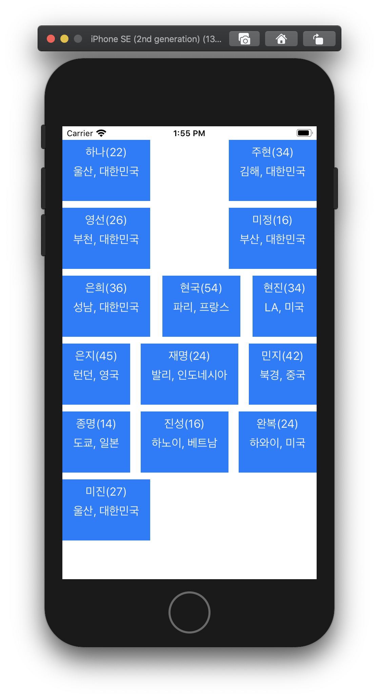

# swift 튜토리얼 따라하면서 익히기 

## 출처 
- [부스트 코스](https://www.edwith.org/boostcourse-ios/joinLectures/12966)
- [하울의 코딩교실](https://www.youtube.com/channel/UCScI4bsr-RaGdYSC2QAHWug)

### Project 

- [AsyncExample](https://github.com/jeonsumin/swift-tutorial/tree/master/AsyncExample)

- [FriendsCollection](https://github.com/jeonsumin/swift-tutorial/tree/master/FriendsCollection)

- [imagePicker](https://github.com/jeonsumin/swift-tutorial/tree/master/ImagePicker)

- [MyDatePicker](https://github.com/jeonsumin/swift-tutorial/tree/master/MyDatePicker)

- [MyFriends](https://github.com/jeonsumin/swift-tutorial/tree/master/MyFriends)

- [PhotosExample](https://github.com/jeonsumin/swift-tutorial/tree/master/PhotosExample)

- [SimpleTable](https://github.com/jeonsumin/swift-tutorial/tree/master/SimpleTable)

- [TRCollectionView](https://github.com/jeonsumin/swift-tutorial/tree/master/TRCollectionView)

- [TRLogin](https://github.com/jeonsumin/swift-tutorial/tree/master/TRLogin)

- [TRMemo](https://github.com/jeonsumin/swift-tutorial/tree/master/TRMemo)

- [TRMusicPlayer](https://github.com/jeonsumin/swift-tutorial/tree/master/TRMusicPlayer)

- [TRNavigationBar](https://github.com/jeonsumin/swift-tutorial/tree/master/TRNavigationBar)

- [TRNews](https://github.com/jeonsumin/swift-tutorial/tree/master/TRNews)

- [TRScrollView](https://github.com/jeonsumin/swift-tutorial/tree/master/TRScrollView)

- [TRTabBar](https://github.com/jeonsumin/swift-tutorial/tree/master/TRTabBar)

- [TRTableView](https://github.com/jeonsumin/swift-tutorial/tree/master/TRTableView)

- [VIewTransition](https://github.com/jeonsumin/swift-tutorial/tree/master/VIewTransition)

- [viewTransiton2](https://github.com/jeonsumin/swift-tutorial/tree/master/viewTransiton2)

